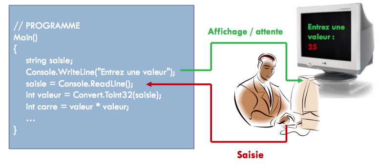
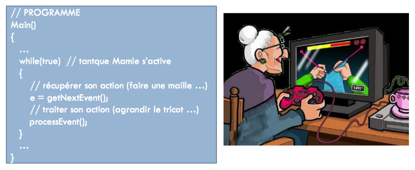

# A la découverte de la programmation évènementielle

L'objectif de ce chapitre est de découvrir les grands principes de la programmation évènementielle.

## Un changement de paradigme

> Au sens large, un [paradigme](https://fr.wikipedia.org/wiki/Paradigme) est un ensemble partagé de croyances et de valeurs, une manière commune de voir les choses. En informatique, un [paradigme](https://fr.wikipedia.org/wiki/Paradigme_(programmation)) est un style fondamental de programmation. La [programmation procédurale](https://fr.wikipedia.org/wiki/Programmation_proc%C3%A9durale) et la [programmation orientée objet](https://fr.wikipedia.org/wiki/Programmation_orient%C3%A9e_objet) sont deux exemples de paradigmes.

Prenons l'exemple d'un programme très simple écrit en C#.

```csharp
static void Main(string[] args)
{
    string saisie;
    Console.WriteLine("Entrez une valeur");
    saisie = Console.ReadLine();
    int valeur = Convert.ToInt32(saisie);
    int carre = valeur * valeur;
    // ...
}
```

Ce programme est écrit selon le paradigme de programmation séquentielle. A partir du point d'entrée (ici la méthode statique `Main`), ses instructions se déroulent toujours dans le même ordre prévu à l'avance. L'utilisateur fait ce que lui demande l'application : c'est ce dernier qui a le contrôle.



Un programme écrit selon le paradigme évènementiel fonctionne différemment : il *réagit* à des évènements provenant du système ou de l'utilisateur. L'ordre d'exécution des instructions n'est donc plus prévu à l'avance. C'est l'utilisateur qui a le contrôle du programme.



La programmation évènementielle s'oppose donc à la programmation séquentielle. Elle est notamment utilisée pour gérer des interactions riches avec l'utilisateur, comme celles des interfaces graphiques homme-machine (GUI, *Graphical User Interface*).

## Les évènements

La programmation évènementielle est fondée sur les **évènements**. Un évènement représente un message envoyé à l'application. Les évènements peuvent être d'origines diverses : action de utilisateur (déplacement de la souris, clic sur un bouton, appui sur une touche du clavier, etc) ou évènement système (chargement d'un fichier, déclenchement d'une minuterie, etc).

Le plus souvent, un évènement contient des informations qui dépendent du type d'évènement. Ces données peuvent être utilisées par l'application pour réagir au mieux. Elle shosit les évènements auxquels elle va répondre par un traitement particulier, et ignore tous les autres.