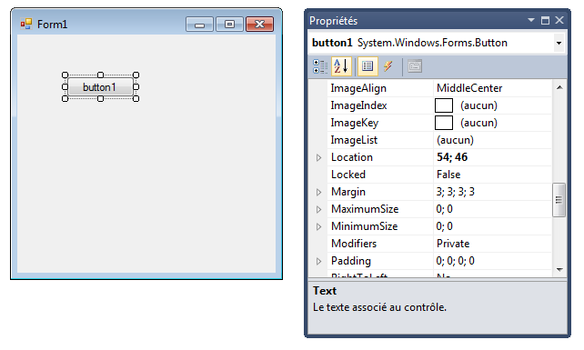
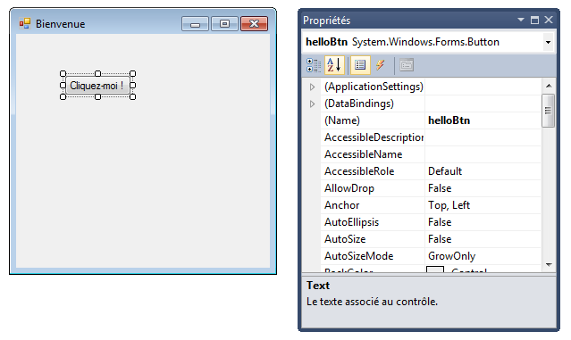
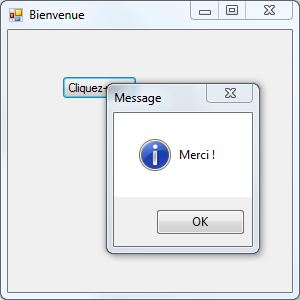
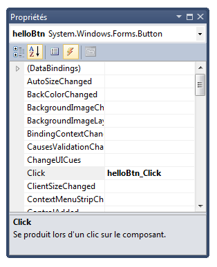

# La technologie WinForms

L'objectif de ce chapitre est d'appréhender le fonctionnement de la technologie Microsoft WinForms.

## Introduction

WinForms (abréviation de Windows Forms) est une plate-forme de création d'interfaces graphiques créée par Microsoft. Elle est adossée au framework .NET et peut être déployée sur des environnements de bureau ou mobiles.

Cette technologie suit le paradigme de programmation évènementielle : une application WinForms est pilotée par des évènements auxquels elle réagit.

## Structure d'une application WinForms

Une application WinForms est structurée autour d'un ou plusieurs formulaires, appelés **forms**.

Lorsqu'on crée une nouvelle application WinForms, l'IDE Visual Studio génère automatiquement plusieurs éléments qu'il est important d'identifier.


Les fichiers du répertoire `Properties` sont gérés par Visual Studio. Il ne doivent pas être édités manuellement. Etudions en détail le reste de l'arborescence.

### Programme principal

Le fichier `Program.cs` correspond au point d'entrée dans l'application. Voici son contenu par défaut.

```csharp
static void Main()
{
    Application.EnableVisualStyles();
    Application.SetCompatibleTextRenderingDefault(false);
    Application.Run(new Form1());
}
```

Comme pour une application console, la méthode statique `Main` est le point d'entrée dans le programme. Cette méthode crée (`new Form1()`) puis affiche le premier formulaire de l'application.

### Anatomie d'un formulaire

Chaque formulaire WinForms est décrit par deux fichiers :

* Un fichier `.Designer.cs` qui contient le code généré automatiquement par l'IDE lors de la conception graphique du formulaire. 
* Un fichier `.cs` qui contient le code C# écrit par le développeur pour faire réagir le formulaire aux évènements qui se produisent. Ce fichier est appelé "*code behind*".

> Après chaque création de formulaire, une bonne pratique consiste à lui donner immédiatement un nom plus parlant, par exemple `MainForm` pour le formulaire principal. Pour cela, faites un clid droit sur le formulaire dans l'arborescence, puis choisissez **Renommer**.

Le fichier "code behind" `.cs` associé à un formulaire est accessible en faisant un clic droit sur le formulaire puis en choisissant **Afficher le code**, ou à l'aide du raccourci clavier **F7**. Voici son contenu initial.

```csharp
public partial class MainForm : Form
{
    public MainForm()
    {
        InitializeComponent();
    }
}
```

Il s'agit de la définition d'une classe avec son constructeur. Cette classe hérite de la classe `Form`, définie par le framework .NET et qui rassemble les fonctionnalités communes à tous les formulaires. On remarque la présence du mot-clé `partial`. Il indique que seul une partie du code de la classe est présent dans ce fichier. Le reste se trouve, comme vous l'avez deviné, dans le fichier `.Designer.cs`.

## Edition graphique d'un formulaire

Un double-clic sur le formulaire dans l'arborescence déclenche l'apparition du **concepteur de formulaire**. Cette interface va permettre d'éditer l'apparence du formulaire. Nous en reparlerons plus loin.


### Ajout d'un contrôle

L'édition du formulaire se fait en y glissant/déposant des **contrôles**, rassemblées dans une boîte à outils (liste de gauche). De nombreux contrôles sont disponibles pour répondre à des besoins variés et construire des IHM riches et fonctionnelles. Parmi les plus utilisés, on peut citer :

* **Label** qui affiche un simple texte;
* **TextBox** qui crée une zone de saisie de texte;
* **Button** qui affiche un bouton;
* **ListBox** qui regroupe une liste de valeurs.

> Pour découvrir le comportement d'un contrôle, testez-le !

Par exemple, l'ajout d'un bouton au formulaire se fait en cliquant sur le contrôle "Button" dans la boîte à outils, puis en faisant glisser le contrôle vers le formulaire.

### Propriétés d'un contrôle

La sélection d'un contrôle (ou du formulaire lui-même) dans le concepteur permet d'afficher ses **propriétés** dans une zone dédiée, située par défaut en bas à droite de l'IDE.



Chaque contrôle dispose d'un grand nombre de propriétés qui gouvernent son apparence et son comportement. Parmi les propriétés essentielles, citons :

* **(Name)** : le nom de l'attribut représentant le contrôle dans la classe.
* **Dock** : l'ancrage du contrôle dans celui qui le contient.
* **Enabled** : indique si le contrôle est actif ou non.
* **Text** : le texte affiché par le contrôle.
* **Visible** : indique si le contrôle est visible ou non.

> Tout comme le nom d'un formulaire, celui d'un contrôle doit être immédiatement modifié avec une valeur plus parlante. 

Par exemple, donnons à notre nouveau bouton le nom `helloBtn` et le texte `Cliquez-moi !`. Donnons également à notre formulaire le titre `Bienvenue` (propriété **Text** du formulaire).



## Gestion des évènements

### Ajout d'un gestionnaire d'évènement

En double-cliquant sur un contrôle dans le concepteur de formulaire, on ajoute un **gestionnaire d'évènement** pour l'évènement par défaut associé au contrôle. Dans le cas d'un bouton, l'évènement par défaut est le clic.

Un gestionnaire d'évènement représente le code exécuté lorsque l'évènement associé se produit. Tous les gestionnaires sont regroupées dans le fichier "code behind" `.cs`. Voici le gestionnaire par défaut associé à un clic sur un bouton.

```csharp
public partial class MainForm : Form
{
    // ...
    
    // Gère le clic sur le boutton helloBtn
    private void helloBtn_Click(object sender, EventArgs e)
    {

    }
}
```

Un gestionnaire d'évènement WinForms correspond à une méthode dans la classe associée au formulaire. Le nom de cette méthode est composé du nom du contrôle suivi de celui de l'évènement. Cette méthode reçoit deux paramètres offrant des détails sur l'évènement :

* `sender` représente le contrôle qui a déclenché l'évènement.
* `e` rassemble les paramètres liés à l'évènement. Son contenu dépend du type de l'évènement.

### Affichage d'un message

Modifions le gestionnaire pour afficher un message à l'utilisateur.

```csharp
private void helloBtn_Click(object sender, EventArgs e)
{
    MessageBox.Show("Merci !", "Message", 
        MessageBoxButtons.OK, MessageBoxIcon.Information);
}
```

La méthode statique `Show` de la classe `MessageBox` affiche un message à l'utilisateur. Plusieurs surcharges de cette méthode permettent de paramétrer l'apparence du message (texte, titre, boutons, icône).

Voici le résultat d'un clic sur le bouton du formulaire, une fois l'application exécutée.



### Gestion des gestionnaires

Dans le concepteur de formulaire, la zone des propriétés permet de gérer les évènements associés à un contrôle (ou au formulaire lui-même). Un clic sur le petit bouton en forme d'éclair affiche la liste de tous les évènements que l'élément peut générer, ainsi que les gestionnaires d'évènements ajoutés.



Le lien entre le contrôle et le gestionnaire se fait dans le fichier `.Designer.cs`. Son contenu est complexe et géré par Visual Studio, mais on peut tout de même le consulter pour y trouver le code ci-dessous.

```csharp
partial class MainForm
{
    // ...

    #region Code généré par le Concepteur Windows Form

    /// <summary>
    /// Méthode requise pour la prise en charge du concepteur - ne modifiez pas
    /// le contenu de cette méthode avec l'éditeur de code.
    /// </summary>
    private void InitializeComponent()
    {
        this.helloBtn = new System.Windows.Forms.Button();
        // ...
        this.helloBtn.Click += new System.EventHandler(this.helloBtn_Click);
        // ...
    }

    #endregion

    private System.Windows.Forms.Button helloBtn;
}
```

L'attribut privé `helloBtn` correspond au bouton ajouté au formulaire. Il est instancié dans la méthode `InitializeComponent`, appelée par le constructeur du formulaire (voir plus haut). Ensuite, on lui ajoute (opérateur `+=`) le gestionnaire `helloBtn_Click` pour l'évènement `Click`.