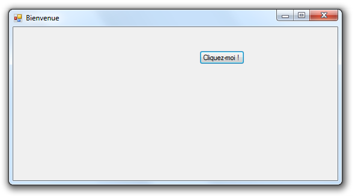
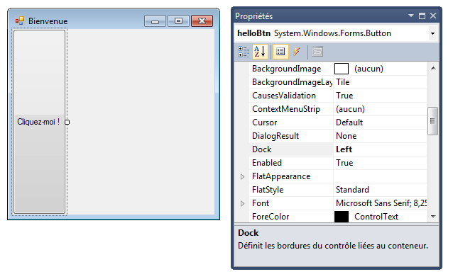

# Besoins fréquents avec les WinForms

Ce chapitre rassemble les solutions à des besoins courants lorsqu'on développe une application WinForms.

## Gérer le redimensionnement d'un formulaire

Une IHM réussie doit adapter sa présentation à la taille de sa fenêtre, notamment lorsque celle-ci est redimensionnée par l'utilisateur.

### Interdire le redimensionnement

Une première solution, simple et radicale, consiste à interdire tout redimensionnement du formulaire. Pour cela, il faut modifier les propriétés suivantes du formulaire :

* **FormBorderStyle** : `Fixed3D` (ou une autre valeur commençant par `Fixed`).
* **MaximizeBox** et **MinimizeBox** ; `false`

Ainsi, le formulaire ne sera plus redimensionnable et les icônes pour le minimiser/maximiser ne seront plus affichés.

### Gérer le positionnement des contrôles

Si le formulaire doit pouvoir être redimensionné, il faut prévoir de quelle manière les contrôles qu'il contient vont être repositionnés pour que le résultat affiché soit toujours harmonieux.

Le positionnement d'un contrôle s'effectue par rapport à son conteneur, qui peut être le formulaire ou un autre contrôle (exemples : **GroupBox**, **Panel**, **TabControl**). Les deux propriétés qui gouvernent le positionnement sont **Anchor** et  **Dock**. 

* **Anchor** décrit l'ancrage du contrôle par rapport aux bordures de son conteneur. Lorsqu'un contrôle est ancré à une bordure, la distance entre le contrôle et cette bordure restera toujours constante. 

> Par défaut, les contrôles sont ancrés en haut (`Top`) et à gauche (`Left`) de leur conteneur.

Si on donne à un contrôle les valeurs d'ancrage `Bottom` et `Right`, il sera déplacé pour conserver les mêmes distances avec les bordures bas et droite lors d'un redimensionnement de son conteneur. C'est le cas pour le bouton dans l'exemple ci-dessous.

* **Dock** définit la ou les bordures du contrôles directement attachées au conteneur parent. Le contrôle prendra toute la place disponible sur la ou les bordure(s) en question, même en cas de redimensionnement.

Voici l'exemple d'un bouton attaché à la bordure gauche de son conteneur.

## Gérer la sortie de l'application

## Afficher un formulaire

### De façon non modale

### De façon modale

## Supprimer manuellement un gestionnaire d'évènement

La suppression manuelle de telles lignes dans le fichier `.Designer.cs` est parfois nécessaire, notamment lorsqu'on a généré des gestionnaires d'évènements pour un contrôle avant de le renommer.

## Vérifier les noms des contrôles d'un formulaire