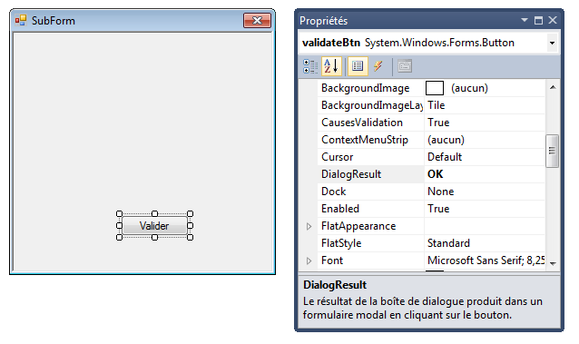

# Besoins fréquents avec les WinForms

Ce chapitre rassemble les solutions à des besoins courants lorsqu'on développe une application WinForms.

## Gérer le redimensionnement d'un formulaire

Une IHM réussie doit adapter sa présentation à la taille de sa fenêtre, notamment lorsque celle-ci est redimensionnée par l'utilisateur.

### Interdire le redimensionnement

Une première solution, simple et radicale, consiste à interdire tout redimensionnement du formulaire. Pour cela, il faut modifier les propriétés suivantes du formulaire :

* **FormBorderStyle** : `Fixed3D` (ou une autre valeur commençant par `Fixed`).
* **MaximizeBox** et **MinimizeBox** ; `false`

Ainsi, le formulaire ne sera plus redimensionnable et les icônes pour le minimiser/maximiser ne seront plus affichés.


### Gérer le positionnement des contrôles

Si le formulaire doit pouvoir être redimensionné, il faut prévoir de quelle manière les contrôles qu'il contient vont être repositionnés pour que le résultat affiché soit toujours harmonieux.

Le positionnement d'un contrôle s'effectue par rapport à son conteneur, qui peut être le formulaire ou un autre contrôle (exemples : **GroupBox**, **Panel**, **TabControl**). Les deux propriétés qui gouvernent le positionnement sont **Anchor** et  **Dock**. 

* **Anchor** décrit l'ancrage du contrôle par rapport aux bordures de son conteneur. Lorsqu'un contrôle est ancré à une bordure, la distance entre le contrôle et cette bordure restera toujours constante. 

> Par défaut, les contrôles sont ancrés en haut (`Top`) et à gauche (`Left`) de leur conteneur.

Si on donne à un contrôle les valeurs d'ancrage `Bottom` et `Right`, il sera déplacé pour conserver les mêmes distances avec les bordures bas et droite lors d'un redimensionnement de son conteneur. C'est le cas pour le bouton dans l'exemple ci-dessous.


* **Dock** définit la ou les bordures du contrôles directement attachées au conteneur parent. Le contrôle prendra toute la place disponible sur la ou les bordure(s) en question, même en cas de redimensionnement.

Voici l'exemple d'un bouton attaché à la bordure gauche de son conteneur.


## Gérer l'arrêt de l'application

### Déclencher l'arrêt

Une application dont le programme principal contient une ligne du type `Application.Run(new MainForm())` se termine automatiquement lorsque l'utilisateur décide de fermer le formulaire `MainForm`.

Depuis un gestionnaire d'évènement, le même résultat s'obtient avec la commande `Application.Exit()`.

### Confirmer l'arrêt

Pour effectuer une demande de confirmation avant la fermeture, il faut ajouter un gestionnaire pour l'évènement **FormClosing** du formulaire. Dans ce gestionnaire, on peut afficher un message puis récupérer le choix de l'utilisateur.

```csharp
// Gère la fermeture du formulaire par l'utilisateur
private void MainForm_FormClosing(object sender, FormClosingEventArgs e)
{
    if (MessageBox.Show("Etes-vous sûr(e) ?", "Demande de confirmation",
        MessageBoxButtons.YesNo, MessageBoxIcon.Question) == DialogResult.No)
    {
        e.Cancel = true;
    }
}
```


la méthode `Show` renvoie son résultatsous la forme d'une valeur de type `DialogResult`. Si l'utilisateur répond `Non` (valeur `DialogResult.No`) à la demande de confirmation , la propriété `Cancel` de l'objet `FormClosingEventArgs` est définie à `true` pour annuler la fermeture. Sinon, l'application s'arrête.

> L'appel à `Application.Exit()` depuis un gestionnaire d'évènement déclenche l'évènement **FormClosing** et donc la demande de confirmation. 

## Afficher un formulaire

Une application WinForms se compose le plus souvent de plusieurs formulaires ayant des rôles différents.

L'affichage d'un formulaire peut se faire de façon modale ou non modale. Un formulaire **modal** doit être fermé ou masqué avant de pouvoir utiliser de nouveau le reste de l'application. C'est le cas des formulaire de type boîte de dialogue qui permettent d'interroger l'utilisateur avant de poursuivre le déroulement de l'application.

### Formulaire non modal

On affiche un formulaire non modal en instanciant un objet de la classe correspondante, puis en appelant la méthode `Show` sur cet objet.

```csharp
// Affiche le formulaire SubForm (non modal)
SubForm subForm = new SubForm();
subForm.Show();
```

### Formulaire modal

On affiche un formulaire modal en l'instanciant, puis en appelant sa méthode `ShowDialog`. Comme la méthode `MessageBox.Show`, elle renvoie un résultat de type `DialogResult` qui permet de connaître le choix de l'utilisateur.

```csharp
// Affiche le formulaire SubForm (modal)
SubForm subForm = new SubForm();
if (subForm.ShowDialog() == DialogResult.OK)
{
    // ...
}
```

Pour que cela fonctionne, il faut ajouter au formulaire modal au moins un bouton, puis avoir défini la propriété `DialogResult` de ce bouton. La valeur de cette propriété est renvoyée par la méthode `ShowDialog` lorsque l'utilisateur clique sur le bouton associé du formulaire modal.



## Supprimer manuellement un gestionnaire d'évènement

La suppression manuelle de telles lignes dans le fichier `.Designer.cs` est parfois nécessaire, notamment lorsqu'on a généré des gestionnaires d'évènements pour un contrôle avant de le renommer.

## Vérifier les noms des contrôles d'un formulaire